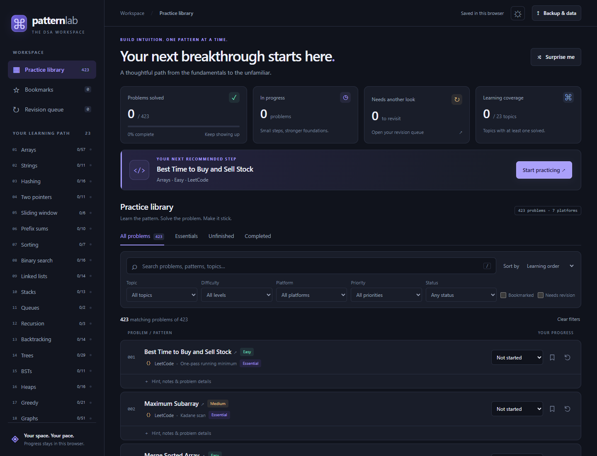

# ⌘ PatternLab

### Build intuition. One pattern at a time.

A curated DSA question library to discover patterns, track progress, 
and prepare for coding interviews through deliberate practice.

[Questions](#question-library) · [Topics](#topics-covered) · [Features](#features)

---

## Question library

**423 questions across seven established coding platforms**, organized into a learning path from fundamentals to advanced techniques. LeetCode forms the core interview practice collection, with additional exercises from competitive programming and other interview platforms.

| Platform | Questions |
| :--- | ---: |
| LeetCode | 255 |
| CSES | 81 |
| AtCoder | 30 |
| Codeforces | 26 |
| HackerRank | 20 |
| GeeksforGeeks | 10 |
| InterviewBit | 1 |
| **Total** | **423** |

The library also includes **13 related platform links** grouped under existing questions. These are not counted as additional questions, and platform filters include alternate links.

### What each question includes

- **Direct problem link** to its coding platform.
- **Topic and pattern** to help recognize the underlying technique.
- **Difficulty level**, with native platform labels or ratings where available. Estimated levels are marked `≈`.
- **Interview priority** with a short explanation of its learning value.
- **Collapsible hint** to offer a nudge without a complete solution.
- **Source and link-verification information** to distinguish checked and unverified links.
- **Personal progress, notes, and timestamps** to keep track of your practice.

### Choose your depth

| Priority | Focus |
| :--- | :--- |
| **Essential** | Build confidence with core interview patterns. |
| **Recommended** | Broaden your toolkit through useful applications and variations. |
| **Advanced / Optional** | Explore more demanding techniques after the fundamentals. |

Priorities are editorial learning recommendations, not claims about interview frequency or company hiring practices.

## Topics covered

| Area | Topics |
| :--- | :--- |
| **Foundations** | Arrays, strings, hashing, sorting |
| **Search and scanning** | Two pointers, sliding window, prefix sums, binary search |
| **Linear structures** | Linked lists, stacks, queues |
| **Recursive thinking** | Recursion, backtracking |
| **Trees and ordering** | Trees, binary search trees, heaps, tries |
| **Algorithmic strategies** | Greedy algorithms, bit manipulation, dynamic programming |
| **Connectivity** | Graphs, union-find |
| **Advanced range queries** | Fenwick trees and segment trees |

## Features

### Find the right question

- Search by question title, topic, pattern, or platform.
- Combine topic, difficulty, platform, priority, and status filters.
- Filter bookmarked questions and those needing revision independently.
- Sort by learning order, difficulty, priority, title, or recently updated.
- Browse dedicated **Essentials**, **Unfinished**, and **Completed** views.
- Navigate the full catalog with pagination and visible result counts.

### Practice with direction

- **Continue practicing** from an unfinished question.
- Follow the **next recommended question** within your current filters.
- Use **Surprise me** to pick a random unsolved question that matches your filters.
- Reveal hints when you need a small push.
- Open problem pages in a new tab while keeping your workspace available.

### Track your progress

- Set each question to **Not started**, **In progress**, or **Done**.
- Bookmark questions for later without changing their status.
- Flag questions for revision and revisit them in a dedicated queue.
- Save notes on approaches, complexity, edge cases, and lessons learned.
- Track update and completion timestamps.
- See solved totals, completion percentage, work in progress, revision counts, and topic-level progress.

### Make it your workspace

- Polished **dark and light themes**.
- Responsive layouts for desktop, tablet, and mobile.
- Topic navigation on desktop and a collapsible menu on mobile.
- Keyboard-friendly controls, visible focus indicators, and reduced-motion support.
- Press **`/`** to jump to search.
- Practice offline in the dashboard; external problem pages require internet.

### Keep your progress

- Automatically save progress, notes, bookmarks, revision flags, theme, and view preferences in this browser.
- Export progress as a JSON backup.
- Import with **merge** or **replace** behavior, with validation before changes are applied.
- Confirm before replacing or resetting progress.
- Continue practicing during a storage failure and export the current session before closing.

Progress stays in the current browser and does not automatically sync across devices. JSON backups let you transfer it between browsers or devices.

---

<strong>Learn the pattern. Solve the problem. Make it stick.</strong>

